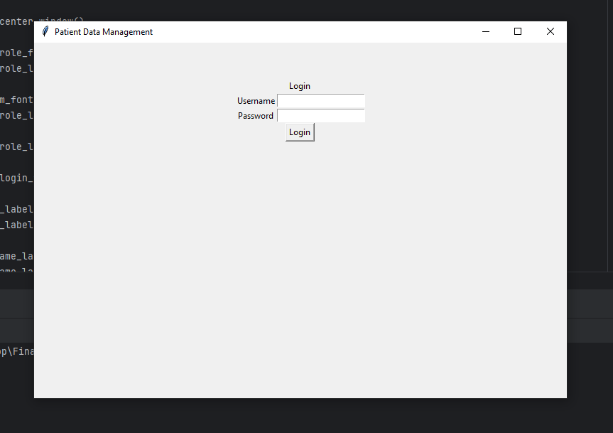

# Final-Project

This is a Python GUI application for managing patient data in a hospital setting. It provides features for user login, patient data retrieval, addition, removal, and various statistical analyses.

## Instructions for use

1. Clone the repository
2. Run main.py

## Usage

Upon launching the application, you will be prompted to log in with your username and password.

