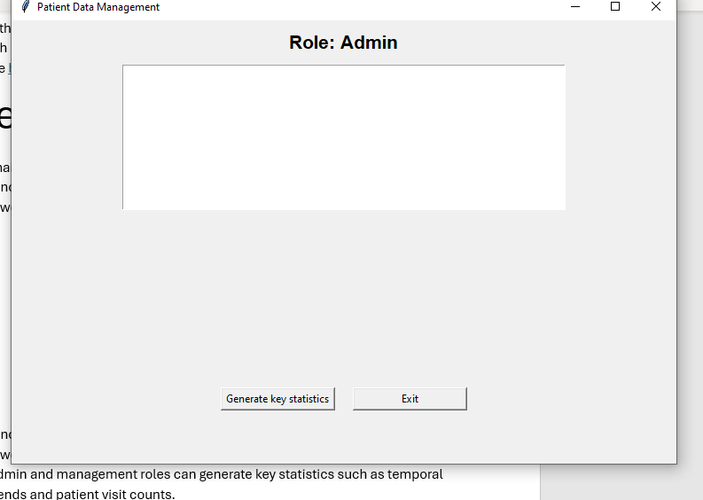
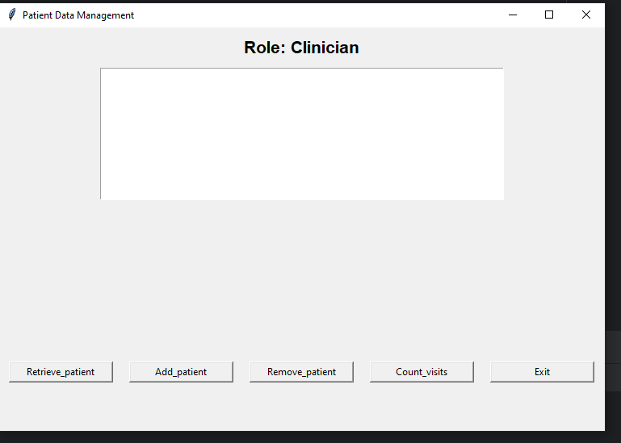

# Final-Project

This is a Python GUI application for managing patient data in a hospital setting. It provides features for user login, patient data retrieval, addition, removal, and various statistical analyses.

## Instructions for use

1. Clone the repository
2. Run main.py

## Usage

1. Upon launching the application, you will be prompted to log in with your username and password.

2. Depending on your role (admin, management, clinician or nurse), you will have access to different features:

    a. Admin and management roles can generate key statistics such as temporal trends and patient visit counts.

    b. Clinician and nurse roles can; retrieve, add and remove patient data. As well as view how many times the patient has visited the hospital.

## Packages Required

1. Tkinter - a standard Python interface to the Tk GUI toolkit shipped with Python, the fastest and easiest way to create GUI applications.

